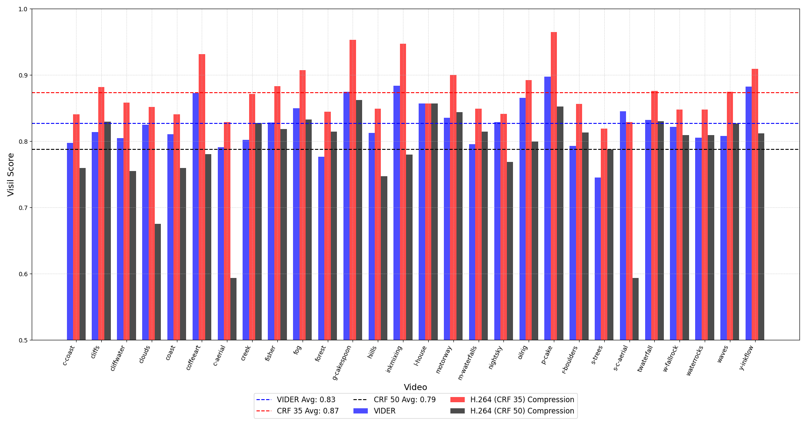
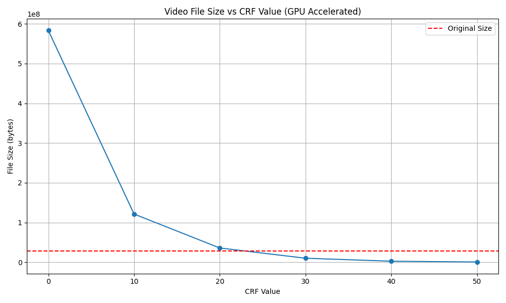

# VIDER

This repository is dedicated to VIDER (Video Reconstruction for Web Affordability), a research initiative part of the CS 6303 Course exploring next-generation video compression and reconstruction technologies. With internet video consumption comprising over 67% of global web traffic, traditional video transmission methods struggle to meet demands in bandwidth-limited environments, particularly in developing regions.

VIDER addresses this challenge by leveraging keyframe-based video reconstruction powered by generative AI. By transmitting only essential keyframes and metadata instead of full video streams, this method reconstructs high-quality videos locally on edge devices using Stable Diffusion-based interpolation models. This approach achieves remarkable bandwidth savings—up to 97.7%—while maintaining perceptual quality and temporal consistency. VIDER is positioned as a transformative solution for scalable and cost-efficient video delivery in modern content distribution networks.

---

# Set up

For this particular project, we are using the `diffusers-0-27-0` python environment. The requirements are all present in `environment.yml`.

You can set up the environment using

```
conda env create -f environment.yml
conda activate diffusers-0-27-0
```

### Docker container

For this project, we use the image `video-generation`, the container `video-generation-neat`, with the local directory `Video Generation` mounted as a volume.

All files related to the project can be found at the path `/root/VideoReconstruction` in the container.

All checkpoints and weights for the SVD finetuned models are in the folder `/root/VideoReconstruction/svd`

The command to create the image and run the container is

```bash
docker build -t video_generation /path/to/Dockerfile ; # this will automaticaly set up the necessary envs

docker run -it
    --name video-generation-neat
    -v "/home/iml1/Desktop/Video Generation":/root # mounting the volume is optional
    --gpus all
    video_generation
```

Alternatively, you can pull the docker image from `aishaa6/topics_in_llms:finalversion` and run it. This has everything pre-set, and you do not need to do anything but run the corresponding files. The relevant files are in the folder `/root/VideoReconstruction/root`

```bash
docker pull aishaa6/topics_in_llms:finalversion;
docker run -it --name video-generation-neat \
    -v "/home/iml1/Desktop/Video Generation":/root/VideoReconstruction/root \ # mounting the volume is optional
    --gpus all \
    aishaa6/topics_in_llms:finalversion

```

---

## Results: Graphs

### Graph 1: Bandwidth Savings


### Graph 2: Video Quality Metrics



### Graph 3: File Size vs CRF for H.264



## Results: Outputs

The `examples` folder contains:

- **Original Videos**: Unprocessed videos used as the base for generation.
- **Generated Videos**: Outputs from our video generation model.

<div style="display: flex; gap: 10px;">
  <div>
    <p><strong>Original Video</strong></p>
    
  </div>
  <div>
    <p><strong>Generated GIF</strong></p>
    
  </div>
</div>
<div style="display: flex; gap: 10px;">
  <div>
    <p><strong>Original Video</strong></p>
    
  </div>
  <div>
    <p><strong>Generated GIF</strong></p>
    
  </div>
</div>
<div style="display: flex; gap: 10px;">
  <div>
    <p><strong>Original Video</strong></p>
    
  </div>
  <div>
    <p><strong>Generated GIF</strong></p>
    
  </div>
</div>
<div style="display: flex; gap: 10px;">
  <div>
    <p><strong>Original Video</strong></p>
    
  </div>
  <div>
    <p><strong>Generated GIF</strong></p>
    
  </div>
</div>
<div style="display: flex; gap: 10px;">
  <div>
    <p><strong>Original Video</strong></p>
    
  </div>
  <div>
    <p><strong>Generated GIF</strong></p>
    
  </div>
</div>
<div style="display: flex; gap: 10px;">
  <div>
    <p><strong>Original Video</strong></p>
    
  </div>
  <div>
    <p><strong>Generated GIF</strong></p>
    
  </div>
</div>